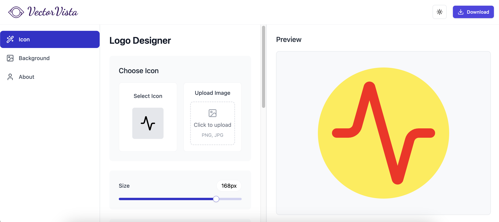

# VectorVista - Logo Maker

VectorVista is a modern web application that allows users to create beautiful logos and graphics with an intuitive interface. Built with React and powered by Vite, it offers a seamless experience for designing logos with various customization options.



## Features

- Interactive logo design interface
- Real-time color customization with advanced color picker
- Multiple design components and templates
- Responsive and modern UI built with Tailwind CSS
- Export functionality to save your designs

## Tech Stack

- React 18
- Vite
- Tailwind CSS
- Radix UI Components
- HTML2Canvas for exports
- Various React color picker libraries

## Installation

1. Clone the repository:
```bash
git clone https://github.com/yourusername/VectorVista.git
cd VectorVista
```

2. Install dependencies:
```bash
npm install
```

3. Start the development server:
```bash
npm run dev
```

4. Build for production:
```bash
npm run build
```

## Usage

1. Open the application in your browser (default: http://localhost:5173)
2. Use the intuitive interface to design your logo
3. Customize colors, shapes, and text as needed
4. Export your design when finished

## Development Scripts

- `npm run dev` - Start development server
- `npm run build` - Build for production
- `npm run preview` - Preview production build
- `npm run lint` - Run ESLint

## Dependencies

### Main Dependencies
- React and React DOM
- Radix UI components for accessible UI elements
- Color picker components
- HTML2Canvas for image export
- Tailwind CSS for styling

### Dev Dependencies
- Vite
- ESLint
- PostCSS
- TypeScript types
- Various build tools

## Contributing

Contributions are welcome! Please feel free to submit a Pull Request.

## License

This project is licensed under the MIT License - see the LICENSE file for details.
